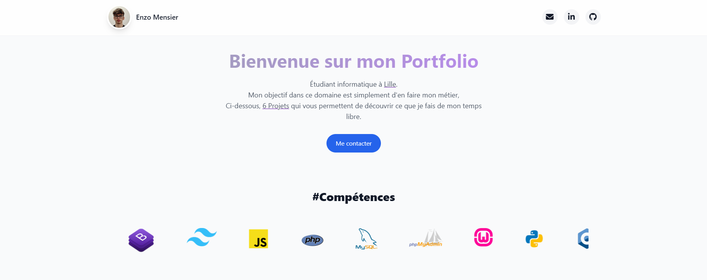

# Mon Portfolio - Développement Web  

## 🎯 Objectif  

Ce portfolio a pour but de **présenter mes projets**, mes compétences et mon parcours en tant qu'**étudiant en informatique**, passionné par le **développement web** et les nouvelles technologies. Il me permet de mettre en avant mes réalisations et de montrer mon évolution dans ce domaine.  

## 🚀 Aperçu du Portfolio

🔗 <u>[Accédez à mon Portfolio](https://mensierenzo.netlify.app)</u> 

  
  

## 🖥️ Description  

Ce site web est conçu en **HTML & CSS**, avec une approche épurée et responsive pour garantir une navigation fluide. Il comprend plusieurs sections :  

- **Accueil** : Petite introduction qui permet de mettre du contexte avant de découvrir mes projets web.  
- **Projets** : Extrait de projets web conçu dans un contexte scolaire ou **auto-didacte** permettant de positionner l'utilisateur de mon niveau dans le développement web.
- **Contact** : Mes réseaux sociaux afin d'échanger avec des recruteurs, entreprises ou passionnés de développement.

## 🔥 Fonctionnalités  

- **Présentation dynamique de mes projets** avec des visuels simples.
- **Affichage responsive** pour une navigation fluide sur mobile et desktop.  
- **Mise en avant des technologies utilisées** sur chaque projet.
- **Intégration de mon CV** permettant d’accéder facilement à mon CV depuis le footer de mon **Portfolio**.  

## 🛠️ Technologies utilisées  

- **Git/GitHub** : Plateforme utile la gestion de code source et la collaboration dans un projet de développement.
- **HTML** : Structure de mon Portfolio.
- **CSS** : Mise en page de mon Portfolio.
- **Netlify** : Services d'hébergement pour des sites web statiques comme ce portfolio.

## 🎯 Objectifs  

<u>Ce portfolio me permet de :</u>  
✅ Valoriser mes compétences en développement web **front-end**.  
✅ Présenter mes projets de manière claire et attractive.  
✅ Attirer une potentiel opportunités d’alternance dans le domaine du développement web ou mobile.  
